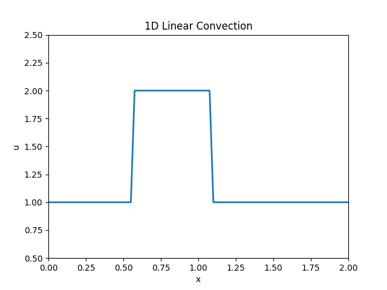

# CFD with python
## Equation
The governing PDE is:
\[
\frac{\partial u}{\partial t} + c \frac{\partial u}{\partial x} = 0
\]

---
the above equation describes a wave moving to the right with constant speed

## Animation

Below is a GIF showing the simulation results:

---